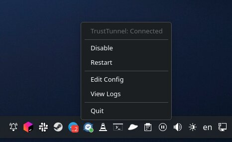
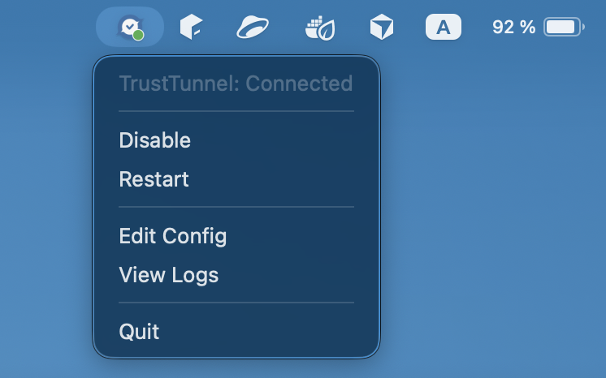

# TrustTunnel Tray Agent

Cross-platform system tray agent for managing the TrustTunnel VPN client. Built with C++17 and Qt6. Supports **Arch Linux** and **macOS**.

<p>
  
  
</p>

## Features

- Tray icon with color status: green (connected), red (disconnected), yellow (transitioning)
- Enable/Disable/Restart the VPN client
- Edit config file (`trusttunnel_client.toml`)
- View live logs
- Status polling every 3 seconds

### Linux (Arch)

- Service control via D-Bus (`org.freedesktop.systemd1.Manager`)
- Status: `systemctl is-active` + `/sys/class/net/tun0`
- Logs via `journalctl` in konsole/gnome-terminal/xterm
- Autostart via `~/.config/autostart/` desktop entry

### macOS

- Service control via `launchctl` (LaunchDaemon)
- Status: `pgrep` + utun interface with IPv4 address
- Logs via `tail -f` in Terminal.app
- VPN autostart via LaunchDaemon (runs at boot, auto-restarts on crash)
- Tray autostart via LaunchAgent (runs at login)
- `.app` bundle with `LSUIElement` (no Dock icon)

## Dependencies

- Qt6 (Widgets, SvgWidgets; + DBus on Linux)
- CMake >= 3.16

### Arch Linux

```bash
sudo pacman -S qt6-base qt6-svg cmake
```

### macOS

```bash
brew install qt@6 cmake
```

## Build

### Linux

```bash
cmake -B build
cmake --build build
```

### macOS

```bash
cmake -B build -DCMAKE_PREFIX_PATH="$(brew --prefix qt)"
cmake --build build
```

## Install

```bash
./install.sh
```

The script detects the platform automatically.

### What it does on Linux

1. Builds the binary
2. Copies `trusttunnel-tray` to `/opt/trusttunnel_client/`
3. Installs systemd service (`trusttunnel.service`) for VPN auto-start at boot
4. Sets up autostart via `~/.config/autostart/trusttunnel-tray.desktop`

After install, start the VPN service:

```bash
sudo systemctl start trusttunnel
```

Service management uses systemd's built-in polkit policy (`org.freedesktop.systemd1.manage-units`). The first action per session will ask for your password; subsequent actions require no re-authentication.

### What it does on macOS

1. Builds the `.app` bundle
2. Copies `trusttunnel-tray.app` to `/opt/trusttunnel_client/`
3. Installs LaunchDaemon (`com.trusttunnel.client`) for VPN auto-start at boot
4. Installs LaunchAgent (`com.trusttunnel.tray`) for tray auto-start at login

After install, start without rebooting:

```bash
sudo launchctl load -w /Library/LaunchDaemons/com.trusttunnel.client.plist
launchctl load ~/Library/LaunchAgents/com.trusttunnel.tray.plist
```

**Important:** Make sure no other `trusttunnel_client` instances are running before loading the LaunchDaemon. Only one instance can run at a time (route/tun conflict).

## Uninstall

### Linux

```bash
sudo systemctl disable --now trusttunnel.service
sudo rm /etc/systemd/system/trusttunnel.service
sudo systemctl daemon-reload
sudo rm /opt/trusttunnel_client/trusttunnel-tray
rm ~/.config/autostart/trusttunnel-tray.desktop
```

### macOS

```bash
sudo launchctl unload /Library/LaunchDaemons/com.trusttunnel.client.plist
launchctl unload ~/Library/LaunchAgents/com.trusttunnel.tray.plist
sudo rm /Library/LaunchDaemons/com.trusttunnel.client.plist
rm ~/Library/LaunchAgents/com.trusttunnel.tray.plist
sudo rm -rf /opt/trusttunnel_client/trusttunnel-tray.app
```

## Project Structure

```
CMakeLists.txt                  - Build configuration (multi-platform)
Info.plist                      - macOS app bundle config (LSUIElement)
src/main.cpp                    - Entry point
src/TrayAgent.h                 - TrayAgent class declaration
src/TrayAgent.cpp               - TrayAgent implementation (#ifdef per platform)
install.sh                      - Cross-platform installation script
trusttunnel.service             - Linux systemd service (VPN at boot)
trusttunnel-tray.desktop        - Linux autostart desktop entry
com.trusttunnel.client.plist    - macOS LaunchDaemon (VPN at boot)
com.trusttunnel.tray.plist      - macOS LaunchAgent (tray at login)
```
